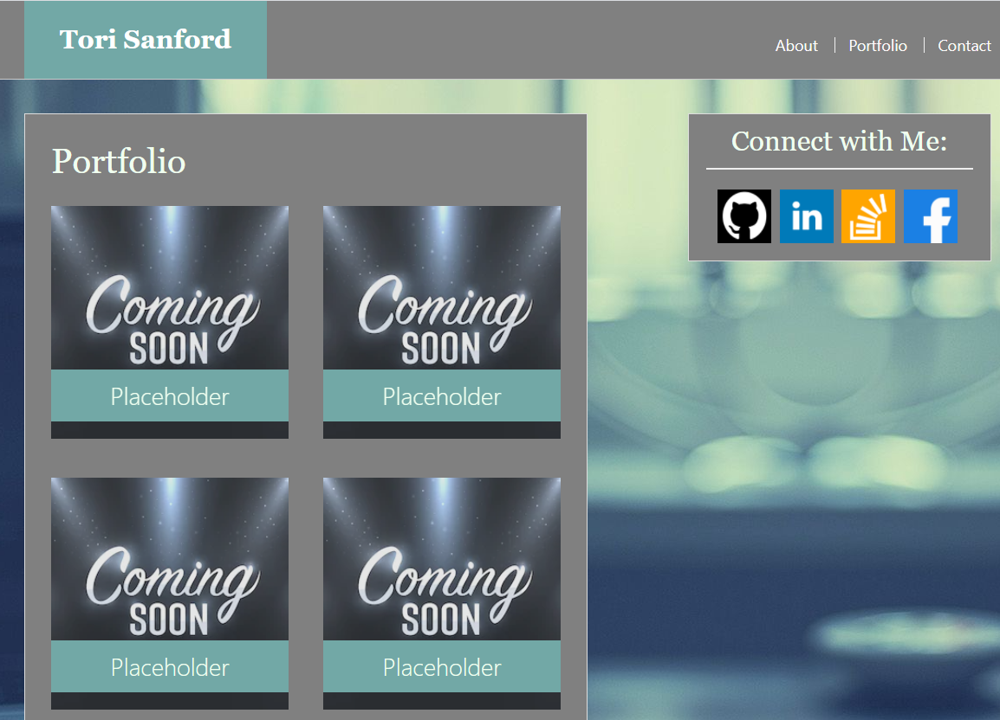
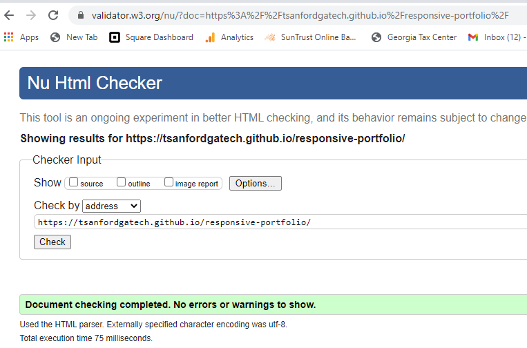

# responsive-portfolio
Created By: Tori Sanford
Date: 12/19/2020
Contact: Tori.danielle.clark91@gmail.com
Link to deployed Project: https://tsanfordgatech.github.io/responsive-portfolio/
Screen shot of project: 

Objective:
Create a responsive portfolio with a navigation bar, responsive layout, and responsive images utalizing bootstrap. 

About this project:
This Project will ensure I can add, and properly size, a nav bar in different web applications or screen sizes. The size rendering should affect my site as well as my images. 

Files included in this repo:
Index html for my main content
porfolio html for the portfolio content
contact html for my content blurb
style css sheet to keep my css out of inline formatting
js for future use and not directy vital to this section of the assignment

Grading criteria and/or requirements:
1. The Bootstrap portfolio should minimize the use of media queries.
2. Screenshots are provided as a reference in the Assets/Images folder. Your app does not need to be exactly like the images. Use Bootstrap to create a similar, responsive layout.
3. Functional, deployed application
4. GitHub repository with README describing the project
5. Navbar must be consistent on each page.
6. Navbar on each page must contain links to Home/About, Contact, and Portfolio pages.
7. All links must work.
8. Must use semantic html.
9. Each page must have valid and correct HTML. (use a validation service)
10. Must contain your personalized information. (bio, name, images, links to social media, etc.)
11. Must properly utilize Bootstrap components and grid system.

Bonus
1. Using Bootstrap, make a sticky footer and use sub-rows and sub-columns on your portfolio site (Hint: Check out the Bootstrap documentation).

Submission/ completed links: 
1. The URLs of the deployed applications
2. The URLs of the GitHub repositories

HTML Validation check: 

